<!-- toc -->

# Freeplane API/Groovy tutorial

This page is best viewed in the Ayu theme
 
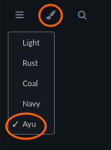

## Start your adventure with Groovy scripting

If you are new to scripting and/or Groovy,
it might be easier to start with something you already know.

## Formula - spreadsheet

Many people are familiar with spreadsheet formulas, so let's start there.\
In e.g. LibreOffice Calc or in MS Office Excel,
to have in cell **A5** the value of cell **A1**,
you can write the formula `=A1`.


Once confirmed with `Enter`, in **A5** you can see the value of **A1**.

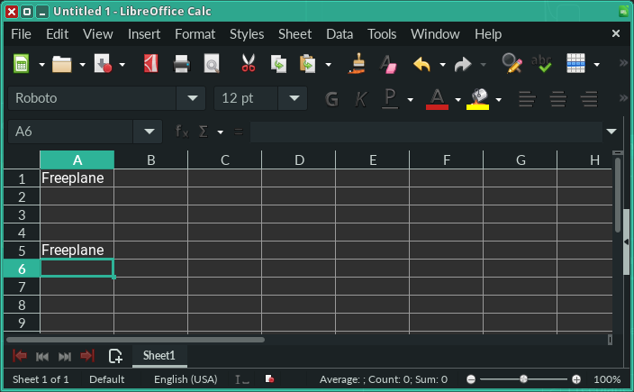

## Formula - node

Similarly, in Freplane you can reference another node by using a formula.
When you write `=` in the 5th node, **Edit Formula** window appears.\
Here `ID_1736361150` is the equivalent of `A1` in a spreadsheet, in the sense that it uniquely identifies a node, just like `A1` uniquely identifies a cell.

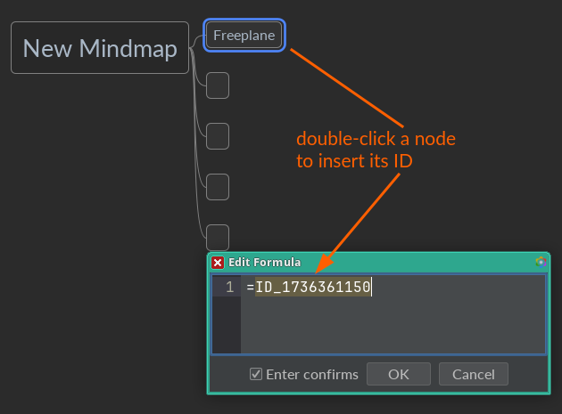

> **Note:** In Freeplane, node ID is generated automatically for each new node. In your mind map you'll find a different ID than `ID_1736361150`.

Once confirmed with `OK`, you can see `(Node) Freeplane`.

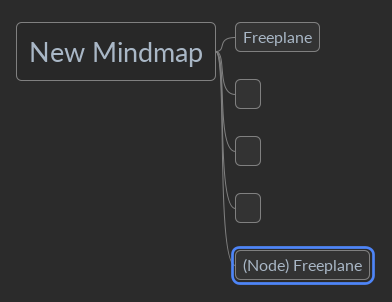

Why not just `Freeplane`?\
It's because, from the scripting perspective, a node is an object.
It has many attributes, e.g. `details`, `note` or `text`, to name a few.

Where are these attributes described?\
They are described in the [Scripting API](https://docs.freeplane.org/api/).

By now you might already have guessed how to correct the formula in the 5th node to display the value of the 1st node,
i.e. by accessing the `text` attribute.
It's done by using a dot notation, i.e. `=ID_1736361150.text`.

Before we have a look at the relevant section in the Scripting API, it's time to introduce Groovy.

## Groovy - intro

Groovy is a programming language, like Java, C#, Python, Visual Basic, etc.\
Whereas in MS Office macros are written in VBA (Visual Basic for Applications), Freeplane scripts (macros) are written
in Groovy.
Unlike in a spreadsheet, where formulas can use only predefined "functions", formulas in Freeplane are free to use all that Groovy has to offer.

You know that Freeplane requires JRE (Java Runtime Environment) to run.
This is because Freeplane is written in the Java programming language, which itself requires JRE to be executed.
Java and JRE is mentioned here because Groovy can be perceived as simplified Java.
Groovy also runs on JRE and is quite similar to Java.
So much that code written in Java can be executed as Groovy (with some minor exceptions).

So why use Groovy if one can use Java?\
Because Groovy is simpler than Java.

OK, but why are we talking so much about Java? This tutorial is about API/Groovy.\
It's because the Scripting API is part of Freeplane's code base, which is written in Java.
Therefore, you'll see Java code at <https://docs.freeplane.org/api/>.

## Scripting API - example

Let's look at our formula `=ID_1736361150.text` and find its Scripting API page.
You know that `=ID_1736361150` points to **Node**, and that it is an object.
The object is **NodeRO** → <https://docs.freeplane.org/api/org/freeplane/api/NodeRO.html>.\
The `text` is **getText()** method of **NodeRO** object.

<details>
<summary>Click to expand <code><b>getText()</b></code></summary>
<blockquote>
<code>java.lang.String getText()</code>
<div class="block">
Raw text of this node which might be plain or HTML text. Possible 
transformations (formula evaluation, formatting, ...) are not applied.
<p>
  See
</p>
<ul>
  <li>
    <a href="https://docs.freeplane.org/api/org/freeplane/api/NodeRO.html#getPlainText()"><code>getPlainText()</code></a>&nbsp;for plain text or use <a href="https://docs.freeplane.org/api/org/freeplane/core/util/HtmlUtils.html#htmlToPlain(java.lang.String)"><code>HtmlUtils.htmlToPlain(String)</code></a>.
  </li>
  <li>
    <a href="https://docs.freeplane.org/api/org/freeplane/api/NodeRO.html#getHtmlText()"><code>getHtmlText()</code></a>&nbsp;for HTML text or use <a href="https://docs.freeplane.org/api/org/freeplane/core/util/HtmlUtils.html#plainToHTML(java.lang.String)"><code>HtmlUtils.plainToHTML(String)</code></a>.
  </li>
  <li>
    <a href="https://docs.freeplane.org/api/org/freeplane/api/NodeRO.html#getTransformedText()"><code>getTransformedText()</code></a>&nbsp;or <a href="https://docs.freeplane.org/api/org/freeplane/api/NodeRO.html#getValue()"><code>getValue()</code></a>&nbsp;for 
    text after formula evaluation.
  </li>
  <li>
    <a href="https://docs.freeplane.org/api/org/freeplane/api/NodeRO.html#getObject()"><code>getObject()</code></a>&nbsp;for possible typed content.
  </li>
  <li>
    <a href="https://docs.freeplane.org/api/org/freeplane/api/NodeRO.html#getTo()"><code>getTo()</code></a>&nbsp;for text/object conversions.
  </li>
</ul>
</div>
<dl class="notes">
<dt>
  Since:
</dt>
<dd>
  1.2
</dd>
</dl>
</blockquote>
</details>

So why `=ID_1736361150.text` and not `=ID_1736361150.getText()`?\
Actually both will work.
The first one is Groovy-style, the second is Java-style, but equally valid in Groovy.

> **Note:** When you see a method starting with `get` and ending with `()`, you can use its stripped-down version in Groovy, i.e. without `get` and `()`.

| Java-style           | Groovy-style    |
|----------------------|-----------------|
| getText()            | text            |
| getPlainText()       | plainText       |
| getTransformedText() | transformedText |

## Formula - node details

Let's go back to our formula example and add **details** to the 1st node, e.g. `API/Groovy tutorial`, then display it in the 5th node using a formula.
You can search the [Scripting API](https://docs.freeplane.org/api/) to find a suitable method – use the search box in the top right.

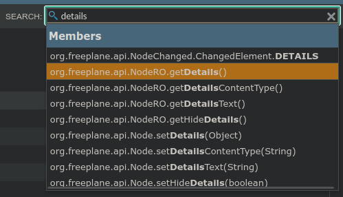

The revised formula is `=ID_1736361150.details` (or `=ID_1736361150.getDetails()`).

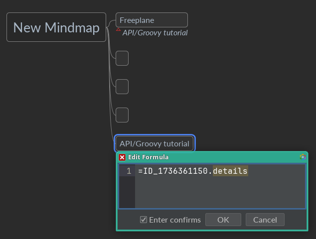

## Formula - Convertible

The page <https://docs.freeplane.org/api/org/freeplane/api/NodeRO.html#getDetails()> informs that **getDetails()** "_returns the text of the details as a Convertible_".
So what is a **Convertible**?\
It's another object. You can see its page at <https://docs.freeplane.org/api/org/freeplane/api/Convertible.html>.

> _**Convertible**: Utility wrapper class around a String that is used to convert node texts to different types. It's especially important for Formulas._

**Convertible** has several methods available, in particular:
* getText()
* getDate()
* getNum()
* getNum0()

This means that we can rewrite our formula to `=ID_1736361150.details.text` (or `=ID_1736361150.getDetails().getText()`).

## Formula - node children

So far you've been using `=ID_1736361150` to point to the 1st node.
Let's use another approach, i.e. parent / child.
When you have a look at <https://docs.freeplane.org/api/org/freeplane/api/NodeRO.html>, you'll notice **getParent()** and **getChildren()** methods.
Let's rewrite our formula to get the first (top) sibling, i.e. the first child of node's parent.

How to refer to self (the node in which the formula is written)?\
In Freeplane it is done by using `node`.

Therefore `=node` points to itself, `=node.details` points to node's details, and `=node.parent` points to the parent.
And since the parent is also a **NodeRO**, you can call **getChildren()** on it, or simply `=node.parent.children`.

It's time to select the first child.
In Groovy it's done by using square brackets → <https://groovy-lang.org/operators.html#subscript-operator>\
The trick is to start counting from **0**, i.e. `=node.parent.children[0]`.

Having the first sibling, you can get its details.


## Script - set details

Let's write and execute a script on the root node.
The easiest way is via `Tools->Edit script…` > `Action` > `New Script`.


Let's change the root node's details.

Earlier, in [Formula - node details](#formula---node-details), the search results contained "setDetails(Object)".
You can find it again and read the API docs now.

Based on the description, `node.setDetails(details)` should do the job.
Why not `=node.setDetails(details)`?\
Because only a formula starts with `=`.
A script does not.

Let's try it then.

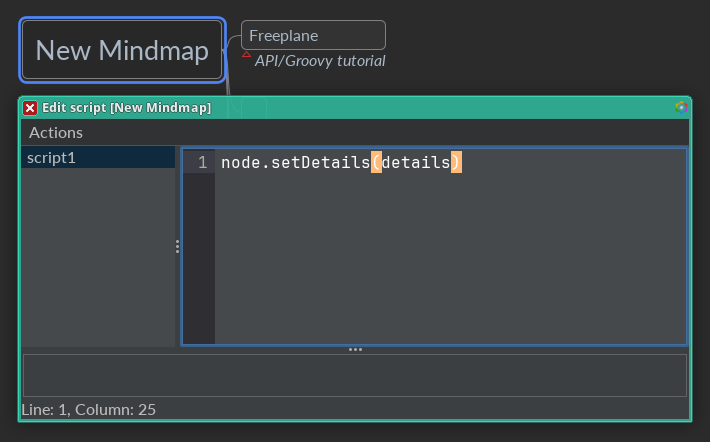

And run it via the menu `Actions` > `Run`.

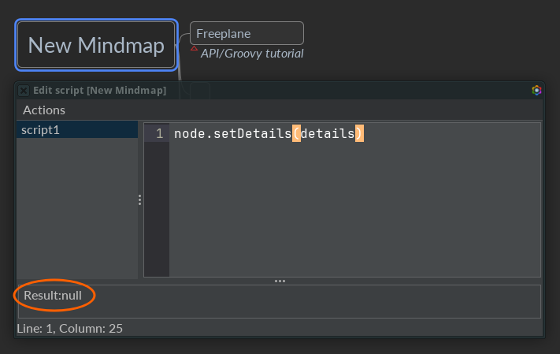

Why nothing changed, except for the output `Result:null`?\
Because `details` is `null`, therefore the script is equivalent to `node.setDetails(null)`.

What is `null`?\
In Groovy, `null` has the meaning of "nothing".

Let's set "something", then: `node.setDetails('I am Groot')`.

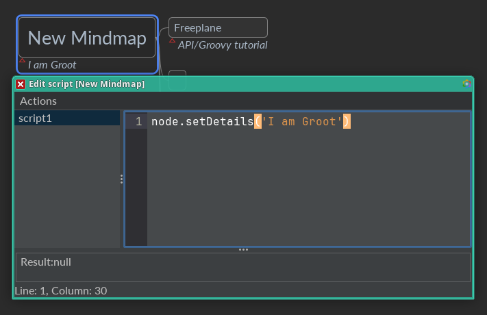

And just like with **getDetails()**, also with **setDetails(details)** there is a Java-style and a Groovy-style way.
```groovy
node.details = 'I am Groot'
```

| Java-style             | Groovy-style         |
|------------------------|----------------------|
| node.setText(value)    | node.text = value    |
| node.setDetails(value) | node.details = value |
| node.setNote(value)    | node.note = value    |

It worked OK, but why does the output still say `Result:null`?\
It's because it is the result of the last expression.
In this case it returned nothing, because it was a **set** operation. This is in contrast to a **get** operation, which usually returns something.
In other words, `node.getDetails()` or `node.details` would have returned the value of details.\
Let's try it: `Actions` > `Run`.


> **Note:** Freeplane allows even shorter expressions for **get** operations, where `node.` is omitted.

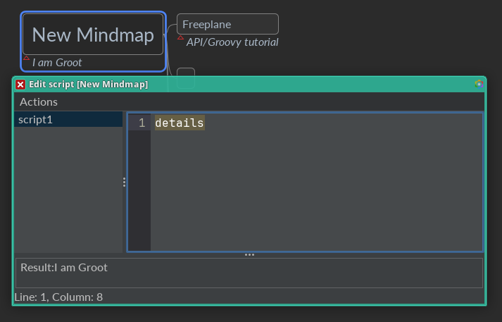

How to remove details from the root node?\
Based on the API docs, "Use `null` to unset the details."

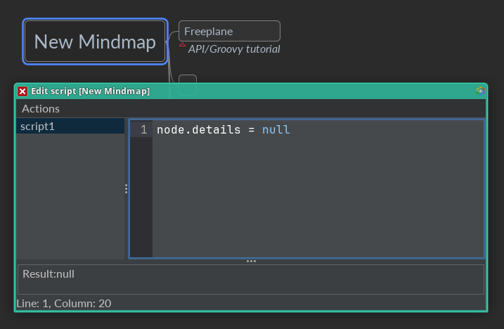

Let's try to read details now.

> **Note:** `node.getDetails()` or `node.details` or `getDetails()` or `details`, all of them will work the same.

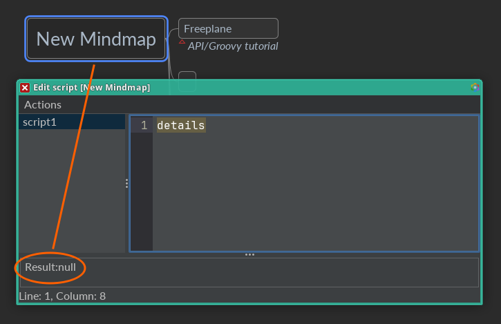

Yes, there's nothing, thus `Result:null`.

## Script - set details for each child

How to set details for each child of the node?

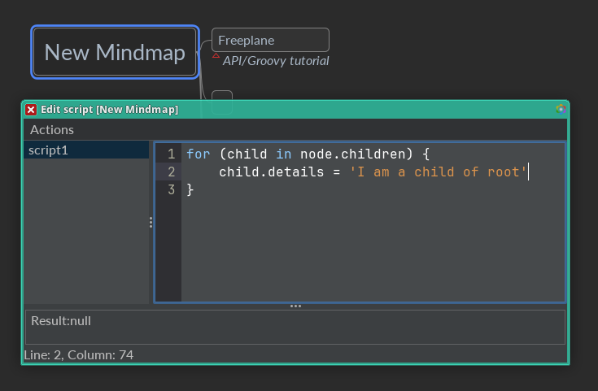

In Groovy, there is a more-often-used way of iterating over a collection of elements.


It's possible, in Groovy, to omit `def child ->` and instead use the default variable name inside `.each { ... }`, i.e. `it`.

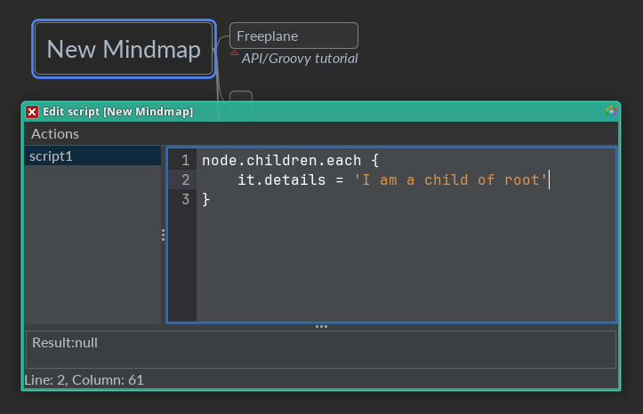

Let's use this knowledge to set each child's details to contain its position among siblings (counted from 0), i.e. 0, 1, 2, 3, 4.\
→ <https://docs.freeplane.org/api/org/freeplane/api/NodeRO.html#getChildPosition(org.freeplane.api.Node)>

```groovy
node.children.each {
    it.details = node.getChildPosition(it)
}
```

This version might be easier to understand.

```groovy
node.children.each { def child ->
    child.details = node.getChildPosition(child)
}
```

> **Note:** `child` is a variable.
> It points to a different node with every iteration of `each`.\
> To define a variable, the keyword `def` is used.

Let's make it even more readable.

```groovy
node.children.each { def child ->
    def position = node.getChildPosition(child)
    child.details = position
}
```

After the script is run, you should see numbers in details.


## Formula - working with numbers

Let's edit the formula in the 5th node, so that it sums up the numbers in siblings' details.

```groovy
=node.parent.children[0..3]*.details*.num.sum()
```

You already know that `node.parent.children[0]` points to the first sibling.\
You also know by now that `node.parent.children[0].details` gets the text of details (`details` usually means `details.text`).\
Earlier, we looked at **Convertible** → [Formula - convertible](#formula---convertible), therefore you can guess what `details.num` will get you.

New Groovy concepts:
* `0..3` means a range from 0 to 3 (inclusive), i.e. 0, 1, 2, 3 → <https://groovy-lang.org/operators.html#_range_operator>
* `children[0..3]` means a list of child nodes in the range [0..3], i.e. [child 0, child 1, child 2, child 3]

In a script, to sum up the numbers in details and place the total into the node's text, you would write
```groovy
def total = 0
node.parent.children[0..3].each { child ->
    total = total + child.details.num
}
node.text = total
```

> **Note:** It's customary to omit `def` before a variable and `->` inside `{ ... }`, i.e. in a [Closure](https://groovy-lang.org/closures.html)

In a formula, to make it more concise, you can use a Groovy shorthand `*.`, which does much of what `.each {}` does → <https://groovy-lang.org/operators.html#_spread_operator> \
In other words `children[0..3]*.details*.num` iterates over each of the child nodes in the range 0..3 and gets `details` from each child, then iterates over the resulting list of details and gets `num` from each one:
* Step 1 results in [details of child 0, details of child 1, details of child 2, details of child 3]
* Step 2 results in [num of details of child 0, num of details of child 1, num of details of child 2, num of details of child 3]

Finally, `.sum()` calculates the sum of numbers in the list.

## NodeRO vs Node

You might have noticed that some node-related methods are described in <https://docs.freeplane.org/api/org/freeplane/api/NodeRO.html>, while other in <https://docs.freeplane.org/api/org/freeplane/api/Node.html>.
**RO** in NodeRO stands for read-only.
The idea behind this segregation is to indicate methods safe for formulas, i.e. the read-only ones.
While Freeplane won't stop you from including a non-RO method, such a formula might produce unexpected effects.
Therefore, it's best to avoid using non-RO methods in formulas and script filters.

## Filter by script and more

Let's add a filter to show nodes whose details is an even number.
Using the GUI, you can do that via `Filter->Compose filter`.
In a script, you can... search for `filter` at <https://docs.freeplane.org/api/> or when you open the same page locally via `Help->Freeplane API…`.

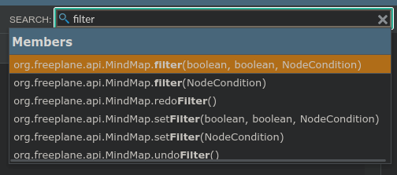

Once you read about [MindMap.filter(...)](https://docs.freeplane.org/api/org/freeplane/api/MindMap.html#filter(boolean,boolean,org.freeplane.api.NodeCondition)), you'll learn that it's a method of **MindMap**.

So how to get **MindMap** in a script if all you have is `node`?\
The answer is one search away...

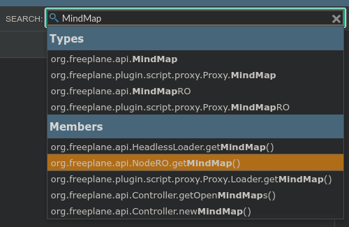

Let's create a script `Tools->Edit script…` and run it `Actions` > `Run`.

```groovy
def showAncestors = true
def showDescendants = false
def condition = { n -> 
    if (n.details.num % 2 == 0) {
        true
    } else {
        false
    }
}
node.mindMap.filter(showAncestors, showDescendants, condition)
```

New Groovy concepts:
* true, false → <https://groovy-lang.org/syntax.html#_booleans>
* if-else – allows to check a (compound) condition and do something in case it evaluates to true, and something else otherwise → <https://groovy-lang.org/semantics.html#_if_else>
* numberA % numberN – computes modulo → <https://en.wikipedia.org/wiki/Modulo>
  * % is the remainder operator -> <https://groovy-lang.org/operators.html#_normal_arithmetic_operators>

You might notice that a Closure `{...}` is used in another context than `.each {...}`.
But the structure is already familiar, with a variable at the begining, followed by an arrow, etc.

What happens when the script is run?

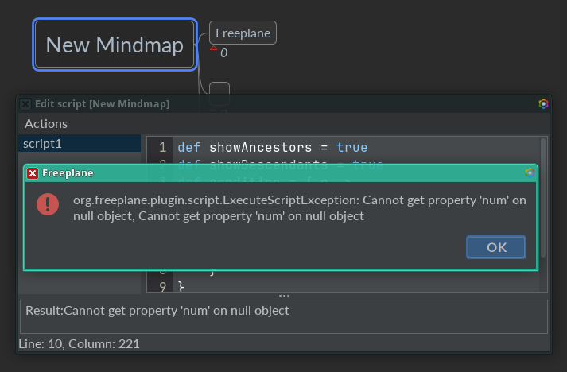

Here's why. The script instructs Freeplane to add a filter which is executed on each node in the mind map.
The script (captured in the variable `condition`) receives the node as its first (and only) argument (variable `n`) and accesses the node's details as number.
But hold on.
The root node has no details.
This means `n.details` will return `null`.
And `null.num` makes no sense.
Hence, "Cannot get property 'num' on null object".

So how to fix it?\
By checking first if details exist, i.e. `n.details != null` or even simpler `n.details` → <https://groovy-lang.org/semantics.html#the-groovy-truth>

```groovy
def showAncestors = true
def showDescendants = false
def condition = { n -> 
    if (n.details && n.details.num % 2 == 0) {
        true
    } else {
        false
    }
}
node.mindMap.filter(showAncestors, showDescendants, condition)
```

New Groovy concepts:
* `&&` means "and" → <https://groovy-lang.org/operators.html#_logical_operators>

Can the script be made shorter?

```groovy
def showAncestors = true
def showDescendants = false
def condition = { n -> n.details && n.details.num % 2 == 0 }
node.mindMap.filter(showAncestors, showDescendants, condition)
```

A bit more, please?

```groovy
def showAncestors = true
def showDescendants = false
def condition = { it.details && it.details.num % 2 == 0 }
node.mindMap.filter(showAncestors, showDescendants, condition)
```

How about a one-liner?
```groovy
node.mindMap.filter(true, false) { it.details && it.details.num % 2 == 0 }
```

New Groovy concepts:
* a Closure outside of parentheses is allowed in Groovy, but only if it's the last parameter of the method

Actually the concept isn't quite as new.
You've seen it already with `.each`, which is a method taking a Closure as its last parameter → <https://docs.groovy-lang.org/latest/html/groovy-jdk/java/util/Collection.html#each(groovy.lang.Closure)>


So one of the earlier scripts could be written with `.each( {...} )` instead of `.each {...}`, i.e.

```groovy
node.children.each( { child -> child.details = node.getChildPosition(child) } )
```

Let's go back to our script filter.
What happens when you change the 1st sibling's details from "0" to "API/Groovy tutorial" and run the "filter" script again?

```groovy
org.freeplane.plugin.script.ExecuteScriptException: 
org.freeplane.plugin.script.proxy.ConversionException: not a number: 'API/Groovy tutorial'
```

Aha, "API/Groovy tutorial" is not a number.
So let's make sure to take only numbers in details → <https://docs.freeplane.org/api/org/freeplane/api/Convertible.html#isNum()>

```groovy
node.mindMap.filter(true, false) { it.details && it.details.isNum() && it.details.num % 2 == 0 }
```

Great.
The filter was accepted. 
But now the formula in the 5th node suffers from the same "not a number" error.
Let's fix that too by considering only the nodes whose details contain a number.
We need to "filter" the list of children, i.e. `node.parent.children[0..3]`.
In Groovy, it can be done with `.findAll {...}` → <https://docs.groovy-lang.org/latest/html/groovy-jdk/java/util/Collection.html#findAll(groovy.lang.Closure)>

```groovy
=node.parent.children[0..3].findAll{ it.details.isNum() }*.details*.num.sum()
```

Let's remove "API/Groovy totorial" from the 1st node's details – `Edit->Node properties->Remove node details`.
This causes an error in our formula: "Cannot invoke method isNum() on null object".

But of course; `it.details` is null for the 1st node.
You can add the same check as in the filter, i.e. `it.details && it.details.isNum()`, but you can also use a Groovy shorthand: `it.details?.isNum()` → <https://groovy-lang.org/operators.html#_safe_navigation_operator>

```groovy
=node.parent.children[0..3].findAll{ it.details?.isNum() }*.details*.num.sum()
```

> **Note:** `.isNum()` works also when `details` is `null`, because `.isNum()` checks for `null` and returns `false` in such case.

All fine and dandy, but why the result of the formula says "6", when there is only one sibling with "2" in its details?


It's because the formula considers all siblings, rather than only the visible ones.

Let's fix that too.


```groovy
=node.parent.children[0..3].findAll{ it.isVisible() && it.details?.isNum() }*.details*.num.sum()
```

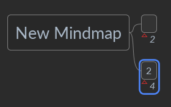
