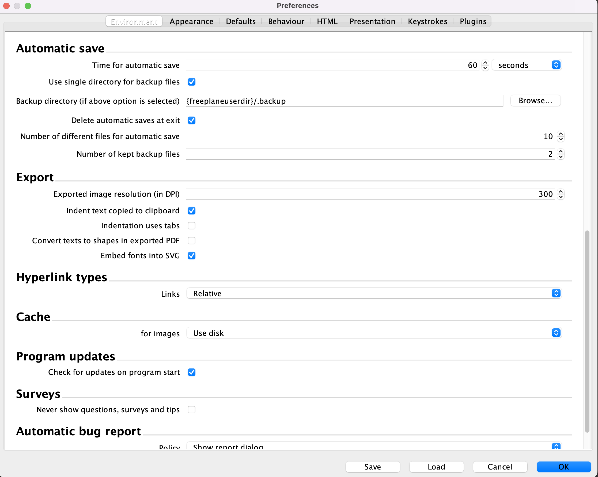
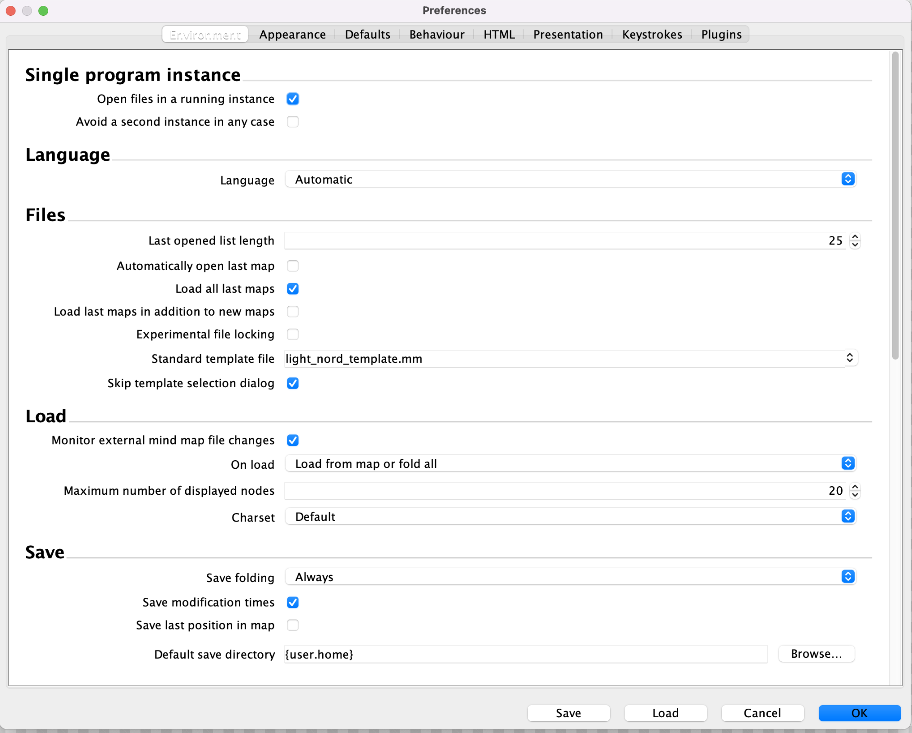

<!-- toc -->

# Working with mind-map files

## Create a new map

Create a new map with `File->New map (Ctrl+N)`.
This creates a new map using the default template.

Create a new map from a different template with `File->New map from template…`.
This opens a file picker that lets you choose a template to use to create a new map.

Create a new password-protected map with `File->New protected (encrypted) map…`.
This opens a password dialog used to encrypt a new map created using the default template.
Encrypted maps cannot be opened or read without the password.

## Open maps

Open an existing map with `File->Open mind map… (Ctrl+O)`.
This opens a file picker to let you chose a Freeplane  `.mm` map file to open.
In this dialogue you can also choose standard or user-defined template mind maps from the drop-down menu at the bottom (see [Templates](templates.md)).

Open an existing map from a list of recently opened maps with `File->Open recent map...`.
Hovering over this Menu action shows a list of recently opened maps.
Click on any map on this list to open it.

If you have Autosave enabled, you can open an autosaved version of an existing map with `File->Open older version`.
See [Autosave](#Autosave) for more information.

## Close maps

Close the active map with `File->Close current map (Ctrl+W)`.

Close all inactive maps (open maps that are not the active map) with `File->Close all other maps`.

Close all open maps, both active and inactive, with `File->Close all maps`.

If you have made any changes to a map after opening it, including changes to a node's folded/unfolded state, and you attempt to close the map, Freeplane will ask you if you want to save the map first.

## Save maps

Save an active map with `File->Save map (Ctrl+S)`.

Save all open maps with `File->Save all maps`.

Save an active map under a new filename with `File->Save map as… (Ctrl+Shift+S)`.

In the saving-dialogue you can choose standard or user-defined template mind maps from the drop-down menu at the bottom (see [Templates](templates.md)).

## Autosave

Enable and customize Autosave with settings in `Tools -> Preferences` in section `Environment->Automatic save`.

  

There you can set the following preferences:

| Setting | Notes |
| ----- | ----- | 
| `Time for automatic save` | Sets the time in milliseconds between autosaves. To disable autosave set this number to 2000000000.|
| `Use single directory for backup files` | If filled, Freeplane will autosave backup files to a single directory. If cleared, Freeplane will autosave backup files for each map to that map's directory |
| `Backup directory` | If  `Use single directory for backup files`  is filled, this sets the directory where autosave files are saved. By default, it is set to `.backup` in the Freeplane user directory.|
| `Delete automatic saves at exit` | If filled, autosave files are deleted automatically when Freeplane is shutdown normally.|
| `Number of different files for automatic save` | Sets the number of different autosave files to keep when Freeplane is open before the autosave files begin to be overwritten.|
| `Number of kept backup files`| Sets the number of different autosave files that are kept after Freeplane is shut down normally.|

## Import

The `File->Import` menu has two types of functions.
One is importing map branches from other Freeplane maps into an active map.
The other is importing content from non-Freeplane maps into an active map.

### Importing Freeplane map branches into an active map

(to be added)

### Importing non-Freeplane map content into an active map

(to be added)

## Export

Mindmaps can be exported to the following formats:
- Documentation formats - Asciidoc,Mediawiki, Markdown, xbel, Twiki, pdf,opml
- Latex - Beamer,book,document,input
- Image formats - Jpeg, png, svg
- XML formats - Raw XML with node formatting, xml
- XHTML - xhtml(clickable html and javascript versions)
- HTML - htm and html
- Microsoft office 2003 formats - Microsoft Excel 2003,Word 2003, Project 2003
- Open office format
- Tasks from Tasks node to TaskJuggler file
- Freeplane 1.1 format(old format)

### Export map
To export the mindmap you can select `File->Export map` from the menu. Map can be exported to following formats.

### Export branches
To export a specific branch in mindmap you can select the node you want to export and then from menu you select `File->Export branches`.

## Other resources

## Change Freeplane settings
Freeplane settings can be customized from `Tools -> Preferences` menu option.

  